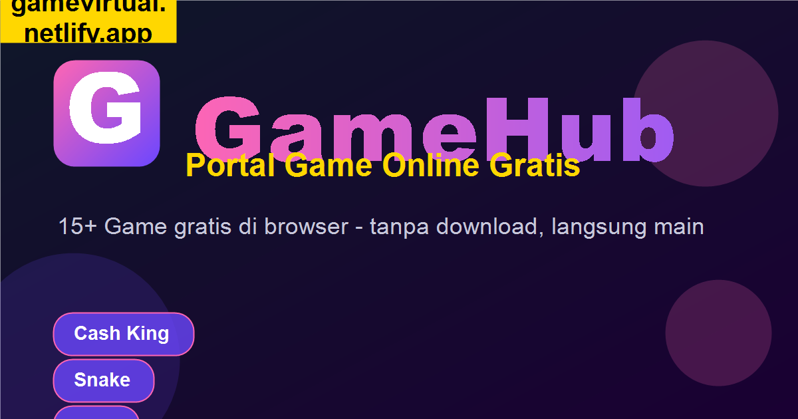

<div align="center">

# 🎮 GameHub

**Portal Game Online Gratis Indonesia — 22+ HTML5 Games di Browser**

[](https://gamexp404.github.io/File-GameHub/)
[](https://gamexp404.github.io/File-GameHub/manifest.json)
[](LICENSE)

[](https://github.com/GameXp404/File-GameHub/stargazers)
[](https://github.com/GameXp404/File-GameHub/network)



</div>

---

## 🌟 Fitur Utama

- 🎮 **22+ Game playable** — clicker, slot, puzzle, refleks, word games, board games
- 🎨 **UI ala CrazyGames** — sidebar kategori + grid responsive + dark theme
- 👤 **Login system** — guest, email, atau Google (client-side via localStorage)
- ❤️ **Favorit & Recently Played** — tracking aktivitas user
- 🔔 **Notifikasi** — log unlocked achievements, game played
- 🛠️ **Admin Panel** — CRUD game, edit layout, export JSON, ganti password
- 📲 **PWA installable** — install sebagai app di Android/iOS/Desktop
- 🌐 **Multi-platform** — desktop launcher (Windows .bat) + Android APK siap Play Store
- 🔍 **SEO + Open Graph** — preview menarik saat di-share di WhatsApp/Facebook/Twitter
- ⚡ **Service Worker** — offline support, smart caching strategy

## 🎯 Live Demo

| Platform | URL | Status |
|---|---|---|
| **GitHub Pages** | [gamexp404.github.io/File-GameHub](https://gamexp404.github.io/File-GameHub/) | 🟢 Active |
| **Netlify Mirror** | [gamevirtual.netlify.app](https://gamevirtual.netlify.app) | 🟡 Backup |

## 🎲 Daftar Game

### Original Games (built from scratch)
| Game | Kategori | Tech Highlight |
|---|---|---|
| 💰 Cash King | Clicker | 4 tema (moneysite/casino/crypto/MLM), prestige system, 20 achievement |
| 🐍 Snake Classic | Arcade | Canvas-based, keyboard control, best score |
| 🔢 2048 | Puzzle | Original game logic |
| ⭕ Tic Tac Toe | Board | vs AI dengan blocking strategy |
| 🧠 Memory Match | Puzzle | 16 cards, move counter, best record |
| ✊ Rock Paper Scissors | Arcade | Score tracking persistent |
| 🔨 Whack-a-Mole | Refleks | 30 detik, escalating difficulty |
| ⚡ Reaction Test | Refleks | ms-precision, average tracking |
| 🔮 Tebak Angka | Trivia | Hot/cold hints, history |
| 🪢 Hangman ID | Kata | 46 kata Indonesia (kota, makanan, sejarah) |
| 📝 Wordle ID | Kata | 50 kata 5-huruf, 6 tebakan, virtual KB |
| 🟦 Tetris | Puzzle | 7 tetromino, line clear, level system |
| 🐦 Flappy Burung | Refleks | Click-to-jump, pipe avoidance |
| 🏓 Pong | Arcade | vs CPU, mouse + keyboard |
| 💣 Minesweeper | Puzzle | 9×9, 10 mines, flood-fill |

### Slot Games (7 variants)
🎰 Mini Slot · 🧧 Slot CaiShen 财神 · 🎰 Slot 5 Reel CaiShen · 🪙 Slot Ultra · 🃏 Slot Advanced (5 paylines + bonus pick) · 🍒 Slot Fruit · 🎰 Slot Demo 5x6

### Coming Soon
♟️ Catur · 🔢 Sudoku · 🏎️ Drag Race · 📈 Crypto Trader · 🌾 Idle Farm · 🏰 Tower Defense · 🚀 Space Shooter · 💎 Match-3 Jewel · 🃏 Solitaire

## 🚀 Quick Start

### Cara main online
Buka [gamexp404.github.io/File-GameHub](https://gamexp404.github.io/File-GameHub/) — tidak perlu install.

### Install sebagai PWA (mobile/desktop)
1. Buka site di Chrome/Edge
2. Address bar → ikon **Install** (⊕) atau menu ⋮ → **Install GameHub**
3. App muncul di Home Screen / Start Menu

### Run lokal (developer)
```bash
git clone https://github.com/GameXp404/File-GameHub.git
cd File-GameHub
# Buka index.html di browser, atau:
python -m http.server 8000
# Visit http://localhost:8000
```

## 🛠️ Admin Panel

GameHub punya admin panel built-in untuk kelola game tanpa edit kode.

| Akses | Klik **Masuk** → tab **🛠️ Admin** |
|---|---|
| **Username** | `admin` |
| **Password** | `GameHub2026!` *(bisa diganti via UI)* |

**Fitur Admin:**
- ➕ Tambah/edit/hapus/reorder game (live preview card)
- 🎨 Layout Manual: edit warna, brand, judul, ukuran card, custom CSS
- 🔑 Ganti password admin (simpan localStorage atau export ke source)
- 📋 Export GAMES array sebagai JSON
- 📥 Bulk import dari JSON (merge atau replace)
- 📲 Upload thumbnail PNG (base64 ke localStorage)

## 🏗️ Tech Stack

- **Frontend**: Vanilla HTML5 + CSS3 + JavaScript (no framework, no build step)
- **PWA**: Service Worker + Web App Manifest
- **Audio**: WebAudio API (offline-friendly, no MP3 dependencies)
- **Storage**: localStorage (auth, favorites, activity, settings)
- **Hosting**: GitHub Pages (primary) + Netlify (mirror)
- **CI/CD**: Auto-deploy via `git push` ke GitHub Pages

## 📁 Struktur Folder

```
File-GameHub/
├── index.html                # Hub utama (admin panel + GAMES array)
├── manifest.json             # PWA manifest (9 icons, shortcuts)
├── sw.js                     # Service Worker (caching strategy)
├── og-image.png              # Social media preview (1200×630)
├── netlify.toml              # Netlify deploy config
├── sitemap.xml               # SEO sitemap
├── robots.txt                # Crawler rules
├── .well-known/
│   └── assetlinks.json       # Android TWA verification
├── icons/                    # PWA icons (9 sizes: 72-512px + maskable)
└── games/
    ├── cash-king.html        # Cash King clicker
    ├── snake.html            # Snake Classic
    ├── tetris.html           # Tetris
    ├── ... (15+ HTML games)
    └── slot-*/               # Slot games dengan asset PNG
```

## 📱 Android APK (Play Store Ready)

Project punya **signed AAB** siap upload ke Google Play Store:
- Built via [PWABuilder.com](https://www.pwabuilder.com/) dari PWA manifest
- Format: `.aab` (Android App Bundle, wajib Play Store sejak 2021)
- Package ID: `app.netlify.gamevirtual`
- Signed dengan keystore (backed up secure)

**Publish flow:** daftar Google Play Console ($25 sekali bayar) → upload AAB → submit review (~1-7 hari).

## 🎯 Roadmap

- [x] Hub UI dengan grid + sidebar (ala CrazyGames)
- [x] 22 game playable
- [x] Admin panel + layout editor
- [x] PWA + Service Worker
- [x] SEO + Open Graph + Sitemap
- [x] Multiple icons (favicon, apple-touch, maskable)
- [x] Android AAB siap Play Store
- [x] Auto-deploy via GitHub Pages
- [ ] Custom domain `.com`
- [ ] Google Analytics 4 integration
- [ ] User leaderboard (Firebase Realtime DB)
- [ ] Multi-language (ID/EN switcher)
- [ ] Real OAuth (Netlify Identity / Firebase Auth)
- [ ] Submit ke Play Store
- [ ] Tambah 10+ game (Sudoku, Catur, Tower Defense)

## 🎨 Screenshot


## 🤝 Credits

- **Icons**: [Noto Emoji](https://github.com/googlefonts/noto-emoji) by Google (Apache 2.0)
- **Inspiration**: [CrazyGames](https://www.crazygames.com), [Games.co.id](https://games.co.id)
- **Built with**: Vanilla JS, ❤️, dan kopi Pekanbaru

## 📜 License

MIT License — free to use, modify, distribute. See [LICENSE](LICENSE).

---

<div align="center">

**Made with ❤️ in Pekanbaru, Indonesia**

[Demo](https://gamexp404.github.io/File-GameHub/) · [Issues](https://github.com/GameXp404/File-GameHub/issues) · [Pull Requests](https://github.com/GameXp404/File-GameHub/pulls)

</div>
